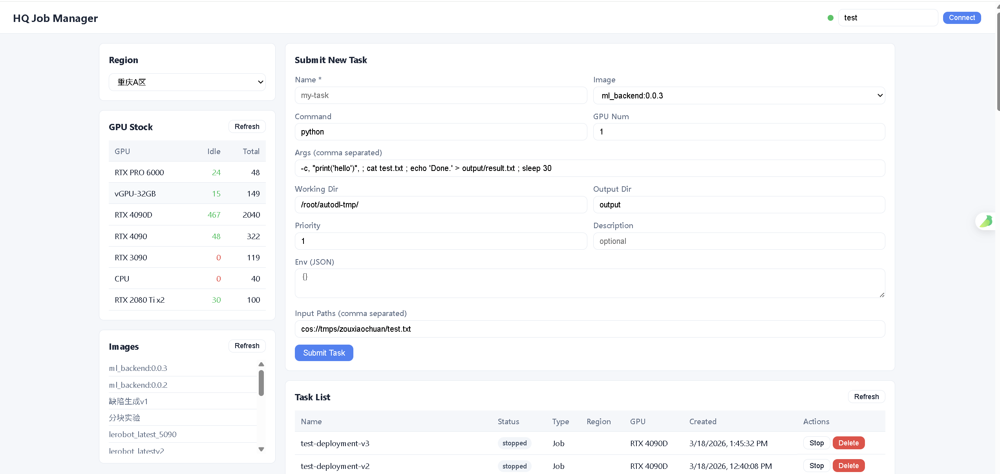

# HQ Job

一个用于图像处理框架的作业调度库，支持本地执行和 AutoDL 云平台部署。

## 功能特性

- **多平台作业引擎**：支持本地执行（`JobEngineLocal`）和 AutoDL 云平台（`JobEngineAutodl`）
- **AutoDL 集成**：完整的 AutoDL API 客户端，支持容器部署、GPU 资源管理、镜像管理等
- **存储抽象**：支持 COS 对象存储和 SCP 传输
- **REST API 服务**：基于 FastAPI 的 HTTP 服务，提供作业管理接口
- **作业生命周期管理**：提交、运行、监控、停止、删除作业

## 安装

```bash
pip install -e .
```

## 快速开始

### 1. 本地作业执行

```python
from hq_job.job_engine_local import JobEngineLocal
from hq_job.job_engine import JobDescription

engine = JobEngineLocal(jobs_dir="./jobs")
job = JobDescription(
    command="python",
    args=["-c", "print('Hello World')"],
    output_dir="output"
)
job_id = engine.run(job)
print(f"Job started: {job_id}")
```

### 2. AutoDL 云平台执行

```python
from hq_job.job_engine_autodl import JobEngineAutodl
from hq_job.job_engine import JobDescription

engine = JobEngineAutodl(token="your_autodl_token")
job = JobDescription(
    name="my_job",
    command="python",
    args=["train.py"],
    image="ml_backend:0.0.1",
    output_dir="output"
)
job_uuid = engine.run(job)
```

### 3. 启动 API 服务

```bash
# 设置环境变量
$env:AUTODL_TOKEN = "your_autodl_token"
$env:API_TOKEN = "your_api_token"

# 启动服务
python -m hq_job.server
```

### 4. WEB访问



## API 接口

服务默认运行在 `http://localhost:8000`

| 方法 | 路径 | 说明 |
|------|------|------|
| GET | `/health` | 健康检查 |
| POST | `/api/v1/jobs` | 提交作业 |
| GET | `/api/v1/jobs` | 列出作业 |
| GET | `/api/v1/jobs/{job_uuid}/status` | 查询作业状态 |
| POST | `/api/v1/jobs/{job_uuid}/stop` | 停止作业 |
| DELETE | `/api/v1/jobs/{job_uuid}` | 删除作业 |
| GET | `/api/v1/resources/regions` | 获取可用区域 |
| GET | `/api/v1/resources/gpu_stock` | 查询 GPU 库存 |
| GET | `/api/v1/resources/images` | 获取镜像列表 |
| GET | `/ui` | Web 管理界面 |

## 环境变量

| 变量名 | 说明 | 必需 |
|--------|------|------|
| `AUTODL_TOKEN` | AutoDL 平台 Token | 是 |
| `API_TOKEN` | API 认证 Token | 推荐 |
| `SERVER_HOST` | 服务监听地址 | 否，默认 `0.0.0.0` |
| `SERVER_PORT` | 服务端口 | 否，默认 `8000` |

## 项目结构

```
hq_job/
├── hq_job/
│   ├── job_engine.py          # 作业引擎基类和 JobDescription
│   ├── job_engine_local.py    # 本地作业引擎
│   ├── job_engine_autodl.py   # AutoDL 作业引擎
│   ├── autodl_client.py       # AutoDL API 客户端
│   ├── server.py              # FastAPI 服务
│   ├── storage/               # 存储模块（COS、SCP）
│   └── scripts/               # 作业执行脚本
├── test/                      # 测试文件
└── pyproject.toml
```

## 依赖

- Python >= 3.6
- FastAPI
- Pydantic
- Requests
- Loguru
- Fabric (SSH)
- psutil

## License

MIT
